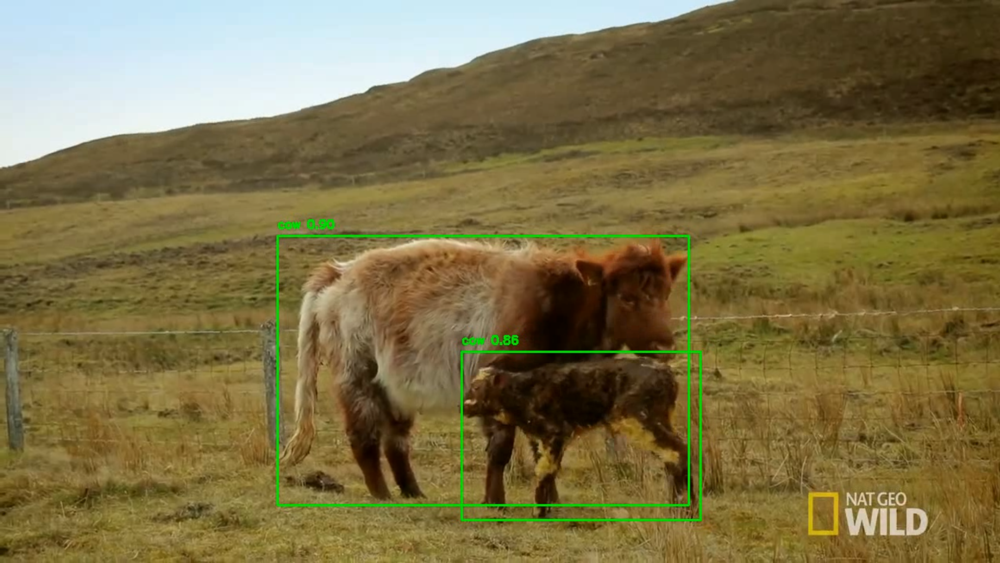
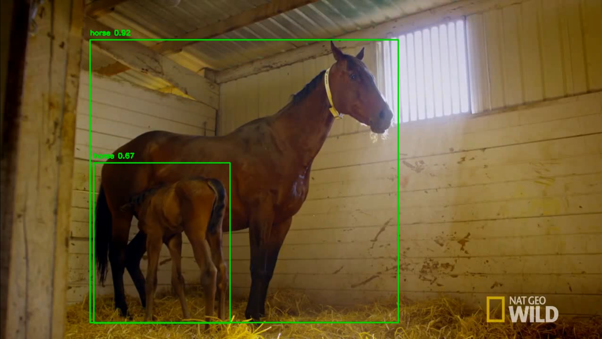

# Animal Detection using YOLOv5

## Project description

In this project, I implemented a pre-trained model (YOLOv5) to detect and classify animals using National Geographic footage. The model draws bounding boxes around the animals, but only if `confidence >= 50%`

## Screencaps from output video

## Video

The video can be found here: [www.youtube.com](https://www.youtube.com/watch?v=b7o9Njpe0Lw)

## TODO: Improvements

The base model is not very accurate. The screencaps above classified the animals correctly, but they are cherry picked. I would say the model is about 35% correct in classifying animals. Detecting them on the other hand, happens at a very good rate.

An improvement would be to train the model using a custom dataset, like COCO.
